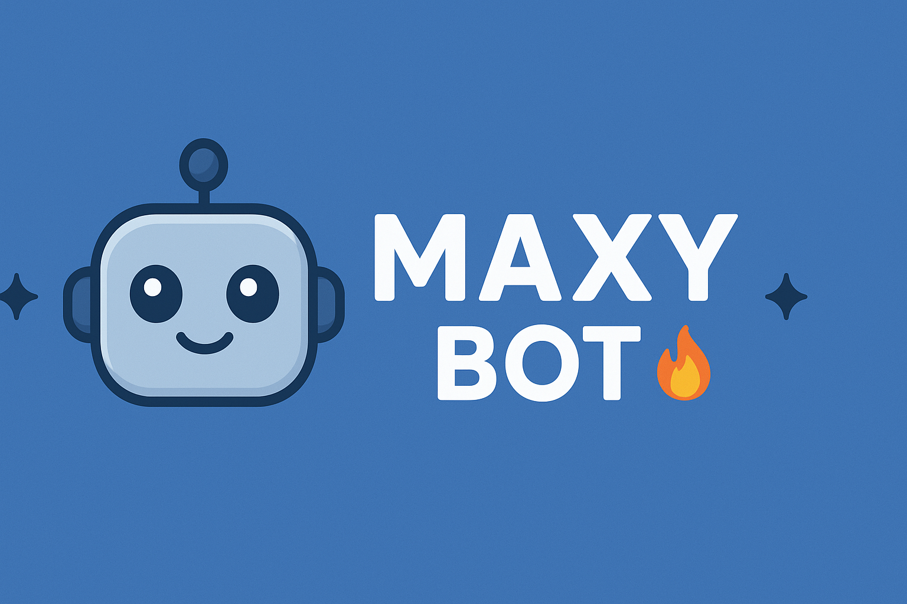

# ✨ Maxy Bot – All-in-One Discord Bot

  

 

---

## 🛠️ Features

- **Moderation & Management:** Powerful and easy-to-use commands for server admins.
- **Fun & Entertainment:** Games, memes, and interactive commands for your community.
- **Leveling System:** Profile & XP system to boost engagement.
- **Image Commands:** Advanced image manipulation features.
- **Reliable & Fast:** Designed to stay online and responsive at all times.

---

## 🔒 Source Code

> ⚠️ **Note:** Maxy Bot is **closed-source**. The bot’s internal code is not publicly available.

---

## 📊 Stats

- **Cogs Loaded:** 10 (see `cogs.txt`)
- **Guilds Served:** 10
- **Commands:** Fully dynamic per cog

---

## ⚡ How to Use

1. Invite Maxy Bot to your server using the invite button above.
2. Configure your server with `/config` commands.
3. Enjoy moderation, fun, and engagement features instantly.

---

## 📄 License

Maxy Bot is **closed-source**. Redistribution or modification is not allowed.  
For support or inquiries, join the official support server.

---

  

